# ENTORNO — comer, comprar e passear a partir do CAES

> Guia da região do CAES — Praça Júlio Prestes, 142, Campos Elíseos, CEP 01218-020.
> Criado em 17/08/2026.

## Como usar isto

**O Google resolve horário, se está aberto agora e como chegar. Este guia resolve o que
o Google não sabe: qual presta, quanto custou e se vale voltar.** Um não substitui o outro.

Cada lugar tem uma marca:

- **[TESTADO]** — alguém foi e aprovou. Diz quem, quando, o que pediu e quanto pagou.
- **[BIZU]** — indicação de colega de turma. Confiança alta, mas ainda não conferida.
- **[CANDIDATO]** — veio de busca na internet, **ninguém foi ainda**. É sugestão, não
  recomendação.

**Regra**: candidato só vira testado depois de ir. Não confiar em nota de aplicativo.

**Saio à paisana** no almoço e no jantar (via de regra), então não há restrição de
ambiente. Fardado é exceção.

## Onde é e como sair daqui

**O curso é em frente à Praça Júlio Prestes**, no centro (Campos Elíseos / Santa Ifigênia),
não na Barra Funda. Confirmado pelo Josemar em 17/08/2026, no local.

| Estação | Linha | A pé | Serve para |
|---|---|---|---|
| **Júlio Prestes** | CPTM **8-Diamante** apenas | **na praça, em frente** | É trem, não metrô. Sentido oeste (Itapevi). Ver ressalva abaixo |
| **Luz** | Metrô **1-Azul** + **4-Amarela** + CPTM | **807 m, 10 min** | **A mais útil de todas** |
| **Santa Cecília** | Metrô 3-Vermelha | **1.164 m, 15 min** | A Linha 3, pros dois lados |
| República | Metrô 3 + 4 | mais longe | Só se for conveniente no trajeto |

**A Luz é a estação-chave.** Dali sai a **Linha 4-Amarela**, que leva **direto, sem
baldeação**, a Higienópolis, Paulista, Faria Lima e Pinheiros. E a **Linha 1-Azul** leva ao
Center Norte e ao Shopping D. É de lá que você sai da região sem complicação.

A **Santa Cecília** cobre o que a Luz não cobre: a Linha 3-Vermelha, que de um lado vai pra
Barra Funda e do outro pro Tatuapé.

**Ressalva sobre a Júlio Prestes**: ela é **terminal da Linha 8-Diamante e só dela** (a
11-Coral não passa lá, apesar de haver projeto futuro no Bom Retiro). Além disso, **houve
descarrilamento na Linha 8 em 13/08/2026 e a estação chegou a ficar fechada**, e existe um
plano estadual, anunciado em 2024, de desativá-la na revitalização do centro.
*[VERIFICAR se está operando normalmente antes de contar com ela.]* Na prática, **conte com
a Luz e a Santa Cecília**, que são metrô e não dependem disso.

*Duas correções de 17/08: este guia nasceu dizendo que a estação da porta era a Marechal
Deodoro (errado, veio do [STATUS.md](STATUS.md) dizer "região da Barra Funda") e que a Júlio
Prestes tinha a 11-Coral (também errado). Os endereços de comércio vieram do slide do SAE e
sempre estiveram certos.*

## Os trajetos a pé, no desenho

**Saída do CAES: Praça Júlio Prestes, 142, Campos Elíseos, CEP 01218-020.**

Os mapas abaixo são traçados sobre a malha viária real do OpenStreetMap, com a rota a pé
calculada por roteador de pedestre (respeita calçada e travessia, não mão de direção de
carro). **As distâncias e os tempos são medidos, não estimados.**

*Correção de 17/08: a primeira versão desta seção trazia distâncias que eu estimei olhando
o traçado das ruas, e várias estavam curtas demais. Os números abaixo substituem aquelas.*

### Estação da Luz — a estação de metrô mais perto

**807 m, cerca de 10 min.** Sai da praça para sudeste, pega a **Alameda Dino Bueno**, vira
à esquerda na **Rua Mauá** e segue 392 m até a estação. É reto e simples.

Dali saem a **Linha 1-Azul** e a **Linha 4-Amarela**, que é o que abre a cidade para você.

### Rua Santa Ifigênia — o comércio de eletrônico

**684 m, cerca de 8 min.** É o destino mais perto de todos. Sai para sudeste, entra à direita
na **Avenida Duque de Caxias** e vira à esquerda na **Rua Santa Ifigênia**, seguindo 478 m.

É onde você resolve cabo, carregador, fone e a **extensão de tomada** que o bizu manda levar,
porque a sala de aula tem poucas tomadas.

### Estação Santa Cecília

**1.164 m, cerca de 15 min.** Sai para noroeste e é praticamente uma reta só: **Rua Helvétia**
por 909 m.

**Fica bem mais longe que a Luz** (807 m). Só vale a pena quando o destino é na
**Linha 3-Vermelha**, como Barra Funda, Brás, Belém, Penha ou Tatuapé. Para o resto, Luz.

### CCB do Bom Retiro — o culto de terça

**1.282 m, cerca de 15 min.** **Alameda Dino Bueno** → **Alameda Nothmann** → **Rua Anhaia**,
e são 619 m na Anhaia até o número 613.

Confirma o que o levantamento das casas de oração já apontava: dá a pé, sem metrô e sem
depender de horário de trem na volta.

### 25 de Março

**2.394 m, cerca de 31 min.** O caminho passa pela Luz e segue: **Av. Duque de Caxias** →
**Rua Mauá** → **Largo General Osório** → **Rua dos Timbiras** → **Avenida Senador Queirós**
→ **Rua 25 de Março**.

Meia hora de caminhada. Se preferir, é mais rápido ir de metrô pela Luz e descer na região da
Sé ou São Bento.

### Feira da Madrugada

**3.122 m, cerca de 37 min a pé**, pela **Rua Mauá** → **Praça da Luz** → **Avenida
Tiradentes** → **Rua Ribeiro de Lima**, que sozinha tem 1.576 m.

Ou seja: **dá para ir a pé**, ao contrário do que eu tinha dito antes. Mas de trem compensa
mais, principalmente carregando compra.

**O horário continua sendo o problema, não a distância.** A feira funciona **de segunda a
sábado, das 00h às 16h**, e o polo principal é na **Rua Oriente, 500, Brás**, com o circuito
se espalhando pelas ruas São Caetano, Monsenhor Andrade, João Teodoro, Tiers e Av. Vautier.
Você sai da aula 16h na segunda e 18h na terça e quarta: quando é liberado, ela já fechou.
**A janela real é a quinta**, com saída 11h30, ou ir bem cedo antes da aula.

### Resumo das caminhadas

| Destino | Distância | Tempo | Ruas principais |
|---|---|---|---|
| **Rua Santa Ifigênia** | 684 m | 8 min | Duque de Caxias → Santa Ifigênia |
| **Estação da Luz** | 807 m | 10 min | Dino Bueno → Rua Mauá |
| **Estação Santa Cecília** | 1.164 m | 15 min | Rua Helvétia |
| **CCB Bom Retiro** | 1.282 m | 15 min | Dino Bueno → Nothmann → Anhaia |
| **25 de Março** | 2.394 m | 31 min | Mauá → Gen. Osório → Senador Queirós |
| **Feira da Madrugada** | 3.122 m | 37 min | Mauá → Tiradentes → Ribeiro de Lima |

Fonte da malha e das rotas: **OpenStreetMap**, roteamento a pé pelo **Valhalla**. Os mapas
são desenhados aqui e abrem sem internet.

## Cultura na porta

Isso é vantagem de estar no centro, e some se você não reparar. Vale principalmente **terça e
quarta, que a saída é 18h00**.

**Sala São Paulo** — na Estação Júlio Prestes, **do outro lado da praça** — **[CANDIDATO]**
Sede da Osesp, uma das melhores salas de concerto do país. Literalmente na sua frente.
Vale olhar a programação e o preço do ingresso avulso.

**Pinacoteca de São Paulo** e **Museu da Língua Portuguesa** — região da Luz, no caminho da
estação — **[CANDIDATO]**

---

## Café que presta

**Corada** — Al. Ribeiro da Silva, 932, Campos Elíseos — **[CANDIDATO]**
Mesas na calçada, lanches e cafés. O que citam de diferente é o pão de queijo recheado com
chutney de cenoura com laranja e queijo meia cura.

**Por um Punhado de Dólares + A Yerba** — R. Pirineus, 86, Campos Elíseos — **[CANDIDATO]**
Cafeteria junto com loja de chás. Café, drinks, salgados e pratos. Aparece como um dos
points da região.

**Padaria Flor da Duque** — Av. Duque de Caxias — **[BIZU]**
Faz café, almoço e janta. Indicação de colega que já fez o curso.

## Almoço entre aulas

**Terraço** — **[BIZU]** — R$ 28,00, come à vontade
Testado por colega de turma. É a referência de custo-benefício até agora.
*[VERIFICAR: endereço exato.]*

**Restaurante Rio Branco** — Av. Duque de Caxias x Av. Rio Branco — **[CANDIDATO]**
Está na lista do SAE por proximidade. Ninguém confirmou se presta.

**Padaria** — Al. Barão de Limeira, 872 — **[CANDIDATO]**

## Jantar de terça e quarta

Nesses dias a saída é **18h00**, então dá tempo de sair da bolha do quartel.

**Ama.Zo** — peruano, matriz nos Campos Elíseos — **[CANDIDATO]**
Cresceu por boca a boca e já abriu segunda casa em Higienópolis. Parece a melhor aposta
de "jantar que vale a pena" perto.

**Higienópolis** (Santa Cecília ou República → Linha 4) — **[CANDIDATO]**
Região de restaurante bom, concentrada e segura para andar à noite.

## Quinta, antes de pegar a estrada

Saída **11h30** e viagem longa pela frente. O que interessa aqui é comer rápido e bem, sem
sentar por duas horas. As opções de almoço acima servem, mas o critério muda: **velocidade**.

*(A preencher depois da primeira quinta.)*

## Abastecimento: padaria, mercado e farmácia

Levantamento de 17/08/2026: **102 estabelecimentos a até 20 minutos a pé** do CAES, todos
com a distância medida por roteador de pedestre, não estimada.

### Padarias

| Padaria | Endereço | A pé | Horário |
|---|---|---|---|
| **Padaria Caxias** | Al. Barão de Limeira, 339 (ou 360) | **698 m · 9 min** | **06h às 22h30, todos os dias** |
| **Cascatinha** | R. General Couto de Magalhães, 172 | **733 m · 9 min** | **05h à meia-noite, dom a sex** |
| Bololokko Bolos Caseiros | Av. Ipiranga, 1241 | 847 m · 11 min | não localizado |
| Light Day | Av. Rio Branco, 1636 | 876 m · 11 min | não localizado |
| Santa Ifigenia Paes&Cia | R. Santa Ifigênia, 57 | 936 m · 12 min | Seg-Sex 06h-20h30 · Sáb-Dom 08h-16h |
| **Padaria Campos Elíseos** | Al. Barão de Limeira, 872 | 939 m · 11 min | **06h às 22h, todos os dias** |
| **Casa Aurora** | R. Aurora, 580 | 969 m · 13 min | **06h às 22h, todos os dias** |
| San Remo Panificadora | R. Prates, 627 | 1.290 m · 15 min | Seg-Sáb 06h às 21h |
| Casa de Bolos | R. Aurora, 886 | 1.305 m · 17 min | não localizado |

**A mais perto é a Caxias**, 9 minutos. **A mais tradicional é a Cascatinha**, de 1953, que
fez 70 anos em 2023, é referência de pão francês (chegam a 5.000 no fim de semana) e de
bolinho de bacalhau. Fica na mesma direção da Estação da Luz e **abre às 5h da manhã**.

A **Padaria Campos Elíseos, de 1972**, é a que o slide do SAE listava só como "Padaria,
Alameda Barão de Limeira, 872". Mistério resolvido.

### Mercados e feiras

| Lugar | Endereço | A pé | Horário |
|---|---|---|---|
| **Dia** | Al. Barão de Limeira, 513 | **647 m · 8 min** | **Seg-Sex 07h-21h · Dom 07h-18h** |
| **Extra** | Av. Rio Branco, 452 | **650 m · 8 min** | não localizado |
| Casa de Carnes Bom Boi | Av. Ipiranga, 1290 | 849 m · 12 min | não localizado |
| Ninki Supermercado | Al. Nothmann, 701 | 896 m · 11 min | não localizado |
| **Feira do Bom Retiro** | R. Cônego Martins | 919 m · 10 min | **sábados, 10h às 17h** |
| Futurama | Av. Cásper Líbero, 390 | 955 m · 12 min | Seg-Sáb 07h30-20h30 · Dom 08h30-14h30 |
| **Dia** | Al. Barão de Limeira, 1114 | ~1,1 km · 14 min | **Seg-Sáb 07h-21h · Dom 08h-21h** |
| Best Market | Largo do Arouche, 175 | 1.194 m · 15 min | Todos os dias, 09h às 23h |
| Mercado Extra | R. das Palmeiras, 187 | 1.199 m · 15 min | Todos os dias, 07h às 22h |

Para a marmita da semana, **Dia e Extra resolvem em 8 minutos**. Lembrando que o CAES tem
2 geladeiras, 2 frigobares e micro-ondas, e que o pote precisa de nome.

**A Feira do Bom Retiro é de sábado**, então não serve para você, que volta para casa na
quinta. Fica registrada para o caso de algum sábado em São Paulo.

### Conveniência, para o que faltou à noite

| Lugar | Endereço | A pé | Horário |
|---|---|---|---|
| RS Musical | R. General Osório, 46 | **379 m · 4 min** | não localizado |
| **Oxxo** | R. José Paulino, 592 | 893 m · 10 min | **24 horas** |
| **Oxxo** | Al. Barão de Limeira, 897 | 976 m · 12 min | **24 horas** |
| Mini Mercado Extra | Av. Rio Branco, 212 | 918 m · 12 min | não localizado |

Os dois **Oxxo abrem 24 horas**. É a rede de segurança para o que faltar de madrugada.

### Farmácias

| Farmácia | Endereço | A pé | Horário |
|---|---|---|---|
| DrogaRadium | Av. Rio Branco, 464A | **690 m · 8 min** | não localizado |
| Drogaria São Paulo | Al. Barão de Limeira, 668 | 712 m · 9 min | não localizado |
| Ecomofarma | Av. Cásper Líbero, 489 | 882 m · 11 min | não localizado |
| **Drogaria São Paulo** | Pça. Júlio Mesquita, 131 | 1.020 m · 13 min | **24 horas** |

Para emergência de madrugada, a **Drogaria São Paulo da Praça Júlio Mesquita abre 24h**.

### O que este levantamento cobre e o que não cobre

**Cobre**: 102 lugares dentro de 20 min a pé, sendo 13 padarias, 21 mercados, 32
conveniências, 4 açougues, 4 feiras e 22 farmácias. **Distância e tempo são medidos**, do
mesmo jeito que os mapas de trajeto.

**Não cobre bem o horário.** Só **41 dos 102** tinham horário cadastrado no OpenStreetMap.
Fui atrás dos principais na busca e consegui confirmar Padaria Caxias, Cascatinha, Padaria
Campos Elíseos e os dois Dia. Os demais estão marcados como **"não localizado"**, e isso é
literal: eu procurei e não achei, não é que deixei em branco. Padaria de bairro raramente
publica horário.

**Duas divergências de endereço** entre o OpenStreetMap e a busca, que só se resolvem no
olho: a **Padaria Caxias** aparece como Al. Barão de Limeira **339** no OSM e **360** na
busca; a **Padaria Campos Elíseos** aparece como **1500** no OSM e **872** na busca (e o
slide do SAE também diz 872, então 872 deve ser o certo). *[VERIFICAR ao passar na rua.]*

**A "Padaria Flor da Duque", o bizu do colega, não existe.** Procurei no OpenStreetMap e na
busca, em várias formas, e não há nada com esse nome na Av. Duque de Caxias nem perto. Ou o
nome está trocado, ou ela fechou. Quando você passar por lá, confere o nome real que eu
corrijo.

## Emergência e utilidade

| O que | Onde |
|---|---|
| Farmácia | Drogaria Nova Duque — Av. Duque de Caxias, 788 |
| Banco | Agência Banco do Brasil — Av. Rio Branco, 1437 |
| Banco 24Horas | Shop. Inter Continental — R. Santa Efigênia, 452 |
| Lotérica | Lotérica Natal — Av. Duque de Caxias, 876 |
| Cabeleireiro | Lissandra Cabeleireiros — Av. Duque de Caxias, 830 |
| Academia | Evoque — Av. Rio Branco, 1457 (aceita Gympass) |
| Pronto-socorro | PS Barra Funda — R. Vitorino Carmilo, 717 |
| Ônibus | Terminal Princesa Isabel — Av. Rio Branco |

## Shoppings pelo metrô e trem

**A escolha padrão é o Complexo Tatuapé.** Não por ser o mais perto em número de estações,
mas por causa da última perna: **você chega dentro do shopping sem sair da estação**, por uma
passarela interna, sem atravessar rua. Nenhum outro perto faz isso.

E é o maior alcançável: **500 lojas, 13 salas de cinema, supermercado e farmácia**, somando
o Shopping Metrô Tatuapé e o Boulevard Tatuapé, que são ligados por dentro.

### Como chegar ao Tatuapé: duas rotas, escolha pelo painel

**Rota A, a mais curta** — 807 m a pé até a **Luz**, e **CPTM Linha 11-Coral** sentido
Estudantes. São **2 estações**: Brás e Tatuapé.

**Rota B, toda de metrô** — 1.164 m a pé até **Santa Cecília**, e **Linha 3-Vermelha** direta
até Tatuapé. São **8 estações**, sem baldeação.

A **A** tem menos estação e menos caminhada. A **B** anda 5 minutos a mais, mas o metrô passa
com mais frequência que a CPTM, principalmente à noite. **Olhe o intervalo no painel e
decida**: se o trem demorar mais que uns 8 minutos, vale a rota B.

### A pegadinha da volta

Em Tatuapé param **três linhas da CPTM**, e duas delas **não chegam à Luz**:

| Letreiro do trem | Linha | Onde termina |
|---|---|---|
| **Luz** | 11-Coral | **É o seu.** Brás e Luz |
| Brás | 12-Safira | Para uma estação antes |
| Brás | 13-Jade | Para uma estação antes |

**Só embarque no que estiver escrito LUZ.** Se errar, desce no Brás e pega o próximo da
Linha 11, que é só mais uma estação.

### O que tem dentro

- **Oba Hortifruti**, formato "Oba Way", que é supermercado e não só hortifrúti — piso
  Tatuapé, R. Domingos Agostim, 91
- **Cacau Show** no piso Metrô, telefone (11) 2225-7303, e outra loja no Boulevard
- **Cinemark** no piso G2 e **Starbucks** no piso Metrô
- Farmácia e praça de alimentação

**Horário**: lojas de **segunda a sábado, 10h às 22h**; domingo e feriado, 14h às 20h.
Praça de alimentação e restaurantes, 11h às 22h.

*Para compra de semana, porém, não compensa carregar dali: são ~40 min de volta com sacola
na mão, e você tem Dia e Extra a 8 minutos do CAES. O Oba vale pelo que o Dia não tem, que é
fruta, verdura e queijo bons.*

### Os outros, e a verdade sobre cada um

| Shopping | Como chegar | Da estação até a porta |
|---|---|---|
| **Complexo Tatuapé** | Luz → CPTM 11 (2 est.) ou Sta. Cecília → Linha 3 (8 est.) | **passarela interna** |
| **Shopping D** | Luz → **Linha 1-Azul** até Armênia, 2 estações | curto |
| **Center Norte + Lar Center** | Luz → **Linha 1-Azul** até Portuguesa-Tietê, 3 estações | curto |
| **Shopping Light** | Sta. Cecília → Linha 3 até Anhangabaú, 2 estações | no centro, pequeno |
| **Pátio Higienópolis** | Luz → **Linha 4-Amarela** até Higienópolis-Mackenzie, 2 estações | **1.135 m, 17 min a pé** |
| **West Plaza** | Sta. Cecília → Linha 3 até Palmeiras-Barra Funda, 2 estações | ~10 min a pé |
| **Bourbon** | Sta. Cecília → Linha 3 até Palmeiras-Barra Funda, 2 estações | ~18 min a pé, passa pelo Allianz |
| **Cidade São Paulo / Center 3 / Pátio Paulista** | Luz → **Linha 4-Amarela** até Paulista, 3 estações | curto, na Paulista |
| **Iguatemi / Eldorado** | Luz → **Linha 4-Amarela** até Faria Lima ou Pinheiros | médio |

**Correção de 17/08 sobre o Pátio Higienópolis**: este guia dizia que ele era "o de melhor
padrão perto, e sem baldeação". A parte das estações está certa, são 2 da Luz pela Linha 4.
Mas a caminhada final eu não tinha medido, e ela é **1.135 m, 17 minutos**. Medi as três
estações possíveis e todas são ruins: Higienópolis-Mackenzie 1.135 m, Santa Cecília 1.382 m,
Marechal Deodoro 1.478 m. Algumas páginas afirmam "157 m, 3 minutos", **e isso está errado**.

**A Luz continua sendo a chave de tudo**: dela saem a Linha 1-Azul (Shopping D, Center Norte)
e a Linha 4-Amarela (Higienópolis, Paulista, Faria Lima, Pinheiros), além da CPTM do Tatuapé.
A Santa Cecília cobre a Linha 3-Vermelha (Barra Funda, Anhangabaú, Tatuapé).

## Vale a viagem

**Mercado Municipal (Mercadão)** — Luz → Linha 1 até São Bento, ou a pé — **[CANDIDATO]**
Clássico de São Paulo, e daqui é pertíssimo. Bom para levar coisa pra casa: queijo,
castanha, bacalhau, tempero.

**Rua 25 de Março** — a pé ou 1 estação — **[CANDIDATO]**
Bugiganga, armarinho e presente barato.

**Santa Ifigênia** — **é o próprio bairro, a pé** — **[CANDIDATO]**
Rua de eletrônico. Cabo, carregador, fone, adaptador, extensão. Lembrando que a sala de
aula tem poucas tomadas e o bizu era levar extensão: resolve aqui, andando.

**Sobre a região:** você é da PM e conhece o centro melhor que qualquer guia, mas fica
registrado porque o guia serve pra planejar rota: Luz e Santa Ifigênia têm trechos pesados,
sobretudo à noite. Seu juízo sobre horário e caminho vale mais que qualquer nota daqui.

## Levar pra casa na quinta

Espaço na bagagem é limitado (a carona divide porta-malas). Então a lógica é: coisa pequena,
que não existe em Guararapes e que não estraga na viagem.

*(A preencher.)*

## Casas de oração da CCB na região

Levantado em 17/08/2026, **19 casas de oração** no anel em volta do CAES. Quase todos os
cultos de meio de semana são **19h30**, e a saída da aula é 16h na segunda e 18h na terça e
quarta, então os três dias dão tempo folgado.

Sua premissa de que cada casa tem um único dia fixo no meio da semana **não se confirmou**:
a maioria tem dois ou três cultos por semana. Bom Retiro, por exemplo, tem terça, quinta e
sábado.

**Distâncias são estimativas** por endereço e CEP, não rota medida. Conferir no mapa.

### SEGUNDA-FEIRA (saída da aula 16h, sobra tempo)

| Casa de oração | Endereço | Culto | Distância | Como chegar |
|---|---|---|---|---|
| **Canindé** | R. Silva Teles, 1611 — 03026-001 | 19h30 | **~3,2 km** | Luz → **Linha 1-Azul** → Armênia + ~10 min a pé |
| Cambuci | R. José Bento, 311 — 01523-030 | 19h30 | ~4 km | Luz → Linha 1-Azul → São Joaquim + ~10 min |
| Belém | R. Pimenta Bueno, 132 — 03060-000 | 19h30 | ~5,5 km | Santa Cecília → Linha 3 → Belém + ~7 min |
| **Santana** | R. Daniel Rossi, 194 — 02019-010 | 19h30 | ~6 km | **Luz → Linha 1-Azul → Santana, direto** |
| Bairro do Limão | R. Carolina Soares, 444 — 02554-000 | 19h30 | ~6,5 km | Luz → Linha 1-Azul → Santana + ônibus. Sem metrô na porta |

### TERÇA-FEIRA (saída 18h)

| Casa de oração | Endereço | Culto | Distância | Como chegar |
|---|---|---|---|---|
| **Bom Retiro** | R. Anhaia, 613 — 01130-000 | 19h30 | **~1,3 km** | **A pé, ~16 min. Sem metrô nenhum** |
| Ponte Pequena | R. Afonso Arinos, 91 — 03033-030 | 19h30 | ~2,5 km | Luz → Linha 1-Azul → Armênia + ~8 min |
| Baixada do Glicério | Pça. Dr. Mario Margarido, 36 — 01514-020 | 19h30 | ~3 km | Luz → Linha 1-Azul → São Joaquim + ~8 min |
| **Água Branca** | Av. Santa Marina, 602 — 05036-000 | 19h30 | ~5 km | **CPTM Linha 8 da própria porta**, 2 estações |
| Vila Guilherme | R. Eugênio de Freitas, 200 — 02060-000 | 19h30 | ~5,5 km | Luz → Linha 1-Azul → Portuguesa-Tietê + ônibus |
| Casa Verde | R. Juca Floriano, 262 — 02530-020 | 19h30 | ~6 km | Sem metrô perto. Ônibus |
| **Lapa** | R. João Pereira, 319 — 05074-070 | 19h30 | ~7 km | **CPTM Linha 8 da própria porta**, 3 estações |
| Pinheiros | R. Marcos Azevedo, 52 — 05428-050 | 19h30 | ~8 km | **Luz → Linha 4-Amarela → Pinheiros, direto** |
| Penha | R. Capitão João Cesário, 160 — 03603-000 | 19h30 | ~9 km | Santa Cecília → Linha 3 → Penha, direto |

### QUARTA-FEIRA (saída 18h)

| Casa de oração | Endereço | Culto | Distância | Como chegar |
|---|---|---|---|---|
| **Barra Funda** | R. Brigadeiro Galvão, 683 — 01151-000 | 19h30 | **~2,2 km** | A pé ~28 min, ou Santa Cecília → Linha 3 → Marechal Deodoro |
| Brás | R. Visconde de Parnaíba, 1616 — 03164-300 | 19h30 | ~4,5 km | Santa Cecília → Linha 3 → Bresser-Mooca + ~10 min |
| **Santana** | R. Daniel Rossi, 194 — 02019-010 | **20h00** | ~6 km | **Luz → Linha 1-Azul → Santana, direto** |
| Vila Maria | R. Filipe Bandeira, 571 — 02126-020 | 19h30 | ~7 km | Luz → Linha 1-Azul → Portuguesa-Tietê + ônibus |

**Horários que não servem**, para não perder viagem: Brás tem terça **14h30** e Lapa tem
quarta **09h30**, os dois em horário de aula. Vila Mariana só tem terça **09h30**. Vila
Pompéia não tem culto em segunda, terça nem quarta (é quinta e sábado).

### Escolha por dia

**Segunda: Canindé. Terça: Bom Retiro. Quarta: Barra Funda.**

A de **terça é a melhor de todas**: dá a pé em ~16 minutos, sem metrô, sem baldeação e sem
depender de horário de trem na volta.

Se quiser trocar distância por comodidade, **Santana é a alternativa de segunda**: fica mais
longe que o Canindé, mas é **Linha 1-Azul direta da Luz**, sem ônibus e mais simples de
voltar à noite. E ela também tem quarta, às 20h.

**Duas ficam na linha que começa na sua porta**: Água Branca e Lapa estão na **CPTM Linha
8-Diamante**, que parte da própria Júlio Prestes. As duas são de terça. Só lembrar da
ressalva sobre a Linha 8 lá em cima.

### Agenda completa das mais próximas

| Casa | Telefone | Todos os cultos |
|---|---|---|
| **Bom Retiro** (~1,3 km) | (11) 97638-6286 | Terça 19h30 · Quinta 20h · Sábado 19h30 · Domingo RJM 10h e culto 18h30 |
| **Barra Funda** (~2,2 km) | (11) 97636-9719 | Quarta 19h30 · Domingo RJM 10h e culto 18h30 |
| **Ponte Pequena** (~2,5 km) | (11) 99378-2823 | Terça 19h30 · Sexta 19h30 · Domingo RJM 10h |
| **Baixada do Glicério** (~3 km) | não informado | Terça 19h30 · Quinta 19h30 · Sábado 19h30 · Domingo RJM 15h |
| **Canindé** (~3,2 km) | (11) 2695-1777 | Segunda 19h30 · Quinta 20h · Sábado 19h30 · Domingo RJM 10h e culto 18h30 |
| **Cambuci** (~4 km) | não informado | Segunda 19h30 · Sexta 19h30 |
| **Brás** (~4,5 km) | (11) 3299-0200 | Terça 14h30 · Quarta 19h30 · Sexta 19h30 · Domingo 10h, RJM 10h e 18h30 |
| **Água Branca** (~5 km) | não informado | Terça 19h30 · Quinta 19h30 · Domingo RJM 10h e culto 18h30 |
| **Belém** (~5,5 km) | (11) 97666-8831 | Segunda 19h30 · Quinta 19h30 · Domingo RJM 10h e culto 18h30 |
| **Vila Guilherme** (~5,5 km) | (11) 99183-6416 | Terça 19h30 · Sexta 19h30 · Domingo RJM 10h e culto 18h30 |
| **Vila Pompéia** (~5,5 km) | (11) 99430-2600 | Quinta 19h30 · Sábado 19h30 · Domingo RJM 10h e culto 18h30 |
| **Santana** (~6 km) | (11) 97056-5962 | Segunda 19h30 · Quarta 20h · Domingo RJM 10h e culto 18h30 |
| **Casa Verde** (~6 km) | (11) 97641-7223 | Terça 19h30 · Sexta 19h30 · Domingo RJM 10h e culto 18h30 |
| **Bairro do Limão** (~6,5 km) | (11) 97632-7093 | Segunda 19h30 · Quinta 20h · Sábado 19h30 · Domingo RJM 10h |
| **Vila Maria** (~7 km) | (11) 97675-0692 | Quarta 19h30 · Sábado 19h30 · Domingo RJM 14h e culto 18h30 |
| **Lapa** (~7 km) | (11) 97683-2506 | Terça 19h30 · Quarta 9h30 · Sexta 19h30 · Domingo 9h30, RJM 14h e 18h30 |
| **Vila Mariana** (~7 km) | (11) 99246-3056 | Terça 9h30 · Quinta 19h30 · Sábado 19h30 · Domingo RJM 10h e culto 18h30 |
| **Pinheiros** (~8 km) | (11) 98941-4008 | Terça 19h30 · Quinta 20h · Domingo RJM 10h e culto 18h30 |
| **Penha** (~9 km) | (11) 99342-8532 | Terça 19h30 · Quinta 19h30 · Sábado 19h30 · Domingo RJM 10h e culto 18h30 |

### De onde vieram estes dados

**O localizador oficial está fora do ar.** `congregacao.org.br` devolve 404, `congregacao.org`
é um servidor sem site configurado, e `congregacaocristanobrasil.org.br` entra em loop de
redirecionamento. O `congregacoes.com.br` depende de GPS e não tem listagem estática.

Tudo aqui veio do **[relatorioccb.net](https://relatorioccb.net/brasil/sao-paulo/sao-paulo/)**,
que **se declara não oficial**, com fichas atualizadas em 08/07/2026. Nenhum dia de culto saiu
de Google Maps.

Por isso: **ligar antes na primeira vez**, principalmente para Canindé e Barra Funda, que
definem a segunda e a quarta.

**Como a varredura foi feita (17/08/2026).** São Paulo tem **497 localidades** no site e não
há filtro por raio nem por dia. Método: extrair o índice da cidade por **faixas do alfabeto**
(A-B, C-J, M-S, T-Z) para descobrir os nomes reais, e depois abrir uma a uma as fichas de
todo o anel próximo. **19 casas de oração** levantadas.

**Não existem** como localidade, apesar de serem bairros conhecidos: Luz, Campos Elíseos,
Santa Cecília, República, Sé, Liberdade, Bela Vista, Consolação, Higienópolis, Vila Buarque,
Paraíso, Pari, Perdizes, Mooca, Catumbi, Carandiru, Vila Romana, Sumaré e Tatuapé. O centro
velho praticamente não tem casa da CCB, o que empurra tudo para o anel de fora.

*Cuidado com uma armadilha do site: pedir "quais destes nomes existem" devolve resposta
errada (chegou a afirmar que Pompéia, Aclimação e Paraíso existiam, e os três dão 404). A
listagem por faixa do alfabeto é confiável; a busca dirigida não é.*

---

## Como este guia cresce

1. **Você foi?** Me diz o nome, o que pediu, quanto pagou e se voltaria. Eu passo para
   **[TESTADO]** com data.
2. **Colega indicou?** Vira **[BIZU]**. O pessoal do **CAO-I/26 está aí desde fevereiro** e
   já errou e acertou por você. É a melhor fonte que existe, melhor que qualquer busca.
3. **Lugar ruim não é apagado**, é marcado como reprovado. Serve para não tentar de novo
   daqui a seis meses.

Fontes das buscas de 17/08/2026: [Catraca Livre](https://catracalivre.com.br/gira/novas-cafeterias-em-sp/),
[Magik JC](https://magikjc.com.br/6-restaurantes-para-conhecer-perto-dos-campos-eliseos/),
[Mobilidade 360](https://mobilidade360.com.br/2025/01/01/shoppings-proximos-linha-3-vermelha-metro-sao-paulo/),
[Moovit](https://moovitapp.com/index/pt-br/transporte_p%C3%BAblico-Shopping_Bourbon-Sao_Paulo-site_50537450-242).
